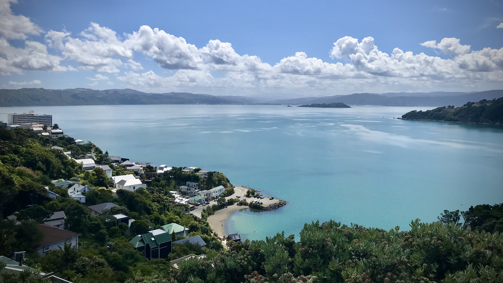

---
# Feel free to add content and custom Front Matter to this file.
# To modify the layout, see https://jekyllrb.com/docs/themes/#overriding-theme-defaults

layout: home
---

I am a *climate* and *environmental data scientist* and have recently moved into banking. I work for TSB as a *financial climate risk analyst*. I combine creative problem solving and climate science expertise with innovative thinking to influence strategic decision making.

I live and work in Wellington (New Zealand). If you're interested in my research, you can find a list of my publications on <a href="https://scholar.google.com/citations?user=Opzrl-cAAAAJ&hl=en" target="_blank">Google Scholar</a>. <a href="/assets/cv.pdf" target="_blank">Here</a> is my CV (updated 08/2023).

You can find me on <a href="https://www.linkedin.com/in/mariokrapp/" target="_blank">LinkedIn</a> or <a href="https://bsky.app/profile/mariokrapp.com" target="_blank">Bluesky</a>. Feel free to get in touch, I'm always curious about new ideas. Or, let's just have a <a href="../meet/">chat</a>.

 

